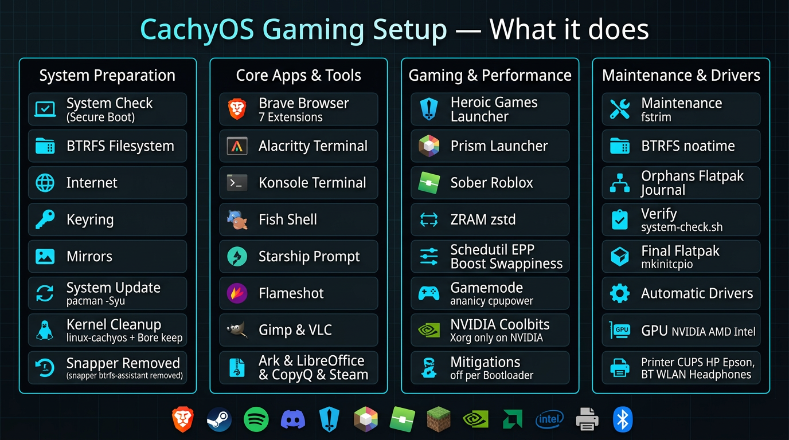

# CachyOS Gaming Setup

> Reproducible setup script for a fresh **CachyOS KDE (BTRFS)** installation. Performs a full system update, configures kernel, drivers and selected applications, and leaves a clean, documented system.



**Who is it for?** Fresh CachyOS install. Not intended for existing systems with important data without a backup.

---

## Table of Contents

- [What it does](#what-it-does)
- [Automatic Hardware Detection](#automatic-hardware-detection)
- [Requirements](#requirements)
- [Installation & Usage](#installation--usage)
- [What gets installed / removed](#what-gets-installed--removed)
- [Helper commands after installation](#helper-commands-after-installation)
- [Verification](#verification)
- [Notes for GitHub & Legal](#notes-for-github--legal)
- [Troubleshooting](#troubleshooting)
- [Uninstall / Rollback](#uninstall--rollback)
- [Contributing](#contributing)
- [License & Disclaimer](#license--disclaimer)

---

## What it does

The script is divided into 9 phases. Each phase is logged (`~/cachyos-logs/`):

1. **0/8 System Check** – Secure Boot, boot partition, BTRFS, internet, keyring, mirrors
2. **1/8 System Update** – `pacman -Syu` with clean abort on error
3. **1.5/8 Cleanup** – Keeps `linux-cachyos` + `linux-cachyos-bore`, removes only with normal dependency check (no `-Rdd`): `snapper`, `btrfs-assistant`, `yakuake`, `spectacle` and others. Fonts and services are cleaned, no blind deletion.
4. **2/8 Base** – `multilib`, `flatpak`, `base-devel`, `git`, Flathub, 7 local helpers: `update-arch`, `clean-arch`, `fix-key`, `update-mirrors`, `configure-spicetify`, `clean-flatpak-caches`, `clean-wine-temp`
5. **3/8 Applications** – Brave (with 7 enforced extensions), Alacritty + Konsole, Fish + Fisher + Starship, Mission Center, Flameshot, Gimp, VLC, Ark, LibreOffice, CopyQ, Spotify (Flatpak), Spicetify, Thunderbird (Universal Mail Client), KDE Connect, Syncthing, RustDesk, Sunshine, Steam, Heroic, PrismLauncher + JDK 8/11/17/21, Sober (Roblox), Waydroid, QEMU, Bottles, Lutris, and more.
6. **4/8 Performance Tweaks** – ZRAM `zstd`, `cpupower` `schedutil`, EPP `balance_performance`, boost on, `vm.swappiness=10`, `vm.vfs_cache_pressure=50`, Ananicy-cpp CGroups Fix, Gamemode, NVIDIA `Coolbits 28` only on NVIDIA, mitigations only for detected bootloader (Limine/systemd-boot/GRUB/rEFInd).
7. **5/8 Paccache Hook** – Skipped (conscious decision, no `-rk2` hook)
8. **6/8 Safe Maintenance** – Only thumbnail/browser caches, orphans only logged, Flatpak unused cleaned, `fstrim.timer` on, BTRFS balance only if >10% used, journal only `vacuum`.
9. **7/8 Verify + 8/8 Bootloader + 9/9 Final** – Integrated verify, `~/system-check.sh` for after reboot, bootloader rebuild, final only `flatpak update` + `mkinitcpio -P`.

**Not included in the public version:** Vencord / Vesktop / MessageLogger. To comply with Discord's Terms of Service, all third-party client modifications have been removed. Additionally, Proton Mail/VPN components were replaced by the universal Thunderbird client to suit everyone's needs. If you want Discord or Proton specific apps, install them natively via Flatpak:
`flatpak install flathub com.discordapp.Discord`
`flatpak install flathub me.proton.Mail`

---

## Automatic Hardware Detection

The script detects hardware at runtime and installs **only** matching drivers (no unnecessary packages):

| Hardware | Detection | What gets installed |
|---|---|---|
| **CPU** | `lscpu` | `intel-ucode` on Intel, `amd-ucode` on AMD |
| **GPU** | `lspci` + `GPU_VENDOR` | **NVIDIA:** `nvidia`/`nvidia-utils`/`nvidia-open-dkms` fallback + Vulkan **· AMD:** `xf86-video-amdgpu` + `vulkan-radeon` **· Intel:** `xf86-video-intel` + `vulkan-intel` **· Unknown:** only `mesa` |
| **Printer** | `lsusb` + `lpstat` + `/dev/usb/lp*` | Only if printer detected: `cups`/`cups-pdf`/`cups-filters`/`gutenprint`/`foomatic`/`ghostscript`, vendor specific `hplip` (HP), `epson-inkjet-printer-escpr` (Epson), `brlaser` (Brother), then `cups.socket` + `avahi-daemon` |
| **Scanner** | `sane-find-scanner` + `lsusb` | `sane` + `simple-scan` only if scanner detected |
| **Bluetooth** | `lsusb`/`lspci`/`rfkill`/`dmesg` | `bluez`/`bluez-utils`/`blueman` + service only if hardware present |
| **WLAN** | `lspci`/`lsusb` | `linux-firmware` + chip specific extras |
| **Sound / Headphones** | always / `lsusb` + `bluetooth` | `sof-firmware` + `alsa-firmware` + `pipewire`/`bluez` – wired and Bluetooth headphones work automatically |
| **Fingerprint** | `lsusb` | `fprintd` only if reader present |
| **Other peripherals** | `lsusb`/`lspci` | Printer, Scanner, BT, WLAN, Webcam, Headphones and more – drivers installed automatically only if hardware is present |

A wide range of peripherals – e.g. printer or headphones – gets its driver automatically if the hardware is detected.

---

## Requirements

- Fresh **CachyOS** with KDE Plasma, BTRFS on `/`, boot partition ideally 2 GB (`/boot` with at least 500 MB free)
- Internet connection
- `sudo` rights
- Secure Boot **off** in BIOS (otherwise `Invalid signature`)
- Backup if you already have data

Tested on: AMD Ryzen 5 5600X + NVIDIA RTX 3060 Ti, 32 GB, Limine. Also works on Intel/AMD GPUs via detection.

---

## Installation & Usage

```bash
# 1. Download
git clone https://github.com/rittertahomallee-blip/cachyos-gaming-setup.git
cd cachyos-gaming-setup

# 2. Make executable (already +x, just to be safe)
chmod +x cachyos-gaming-setup.sh

# 3. Run
./cachyos-gaming-setup.sh
# or
sudo ./cachyos-gaming-setup.sh
```

The script asks once for `sudo`, writes two logs:

- `~/cachyos-logs/install_YYYYMMDD_HHMMSS.log` – everything
- `~/cachyos-logs/errors_YYYYMMDD_HHMMSS.log` – errors only

First run takes about 15–30 minutes depending on internet and packages.

After finish:

```bash
sudo reboot
# choose Bore kernel in boot menu, then
~/system-check.sh
# open Spotify once, log in, close it, then
configure-spicetify
```

---

## What gets installed / removed

**Removed (only with `pacman -Rns`, no force):** `snapper`, `cachyos-snapper-support`, `limine-snapper-sync`, `yakuake`, `spectacle`, `kmail`, `kontact` and other PIM, `elisa`, `dragon`, `discover`, `octopi`, `gnu-free-fonts`. Before removal it checks if the package exists and if the running kernel must be kept.

**Installed (selection):** Brave, Alacritty, Konsole, Fish, Starship, Mission Center, Flameshot, Gimp, VLC, LibreOffice, CopyQ, Spotify, Spicetify, Steam, Heroic, PrismLauncher, Sober (Roblox), BedrockOnLinux (AUR), Waydroid, QEMU, Bottles, Lutris, Bauh, Variety, Kvantum. Full list differs from private version (public is shortened for ToS).

**Not touched:** System languages (`de`+`en` stay package-managed), man pages, firmware is not deleted.

---

## Helper commands after installation

Located in `~/.local/bin` and immediately in `PATH`:

- `update-arch` – `pacman -Syu` + `flatpak update` + `mkinitcpio -P` + `paru/yay -Syu`
- `clean-arch` – shows orphans, cleans `paccache -rk2`, `journal --vacuum`, never runs `bleachbit` automatically
- `fix-key` – repair keyring
- `update-mirrors` – `cachyos-rate-mirrors` / `reflector`
- `configure-spicetify` – sets up Spicetify for Spotify Flatpak (minimal `filesystem` override, no ad-blocking included – theming only; ad-blocking would violate Spotify ToS)
- `clean-flatpak-caches --yes` – clears only `~/.var/app/*/cache`
- `clean-wine-temp --yes /path/to/prefix` – clears only `.../AppData/Local/Temp` of a *given* prefix
- `clean-shader-cache --yes` – clears Mesa/NVIDIA/DXVK shader caches

---

## Verification

During run: `PASS`/`FAIL` in verify block.

After reboot:

```bash
~/system-check.sh
# expected: Bore kernel active, standard+Bore installed, NVIDIA/driver depending on hardware, mitigations off only if set in phase 4, ZRAM active, fstrim.timer on
```

The integrated verify block runs directly; after reboot use `~/system-check.sh` to validate (watchdog without `nowatchdog` is intentional).

---

## Notes for GitHub & Legal

To avoid problems on GitHub:

- **License:** MIT (see below). Allows fork, use, even commercial, as long as license is included. No copyleft.
- **No Discord ToS violation:** This public version contains **no** Vencord, Vesktop or MessageLogger. Private version stays local.
- **No proprietary redistribution:** The script only downloads packages from official Arch/CachyOS/Flathub/AUR sources. It bundles no binaries.
- **Trademarks:** CachyOS, Brave, Steam, NVIDIA, AMD, Intel are trademarks of their owners. Project is not affiliated.
- **No `curl | bash` from strangers:** Only external download is `fisher.fish` from `jorgebucaran/fisher` (MIT) and is stored only as Fish function.
- **Transparency:** Every change is logged, no hidden `rm -rf`, no `pacman -Rdd`. Orphans and `.pacnew` are only logged.
- **Privacy:** Script only reads local hardware via `lspci`/`lsusb`/`lscpu`. It sends nothing outward except normal `pacman`/`flatpak` downloads. No system report is uploaded.

If you make the repo public, do not add `info/cachyos_ALLES_bericht.txt` with serial numbers. Use `inxi -Fz --filter` for bug reports.

---

## Troubleshooting

- **Build fails (`pacman -Syu` error):** `cat ~/cachyos-logs/errors_*.log`, then try `fix-key` and `update-mirrors`. No `--overwrite '*'` in script because it hides conflicts.
- **Bore kernel missing after reboot:** `pacman -Q linux-cachyos-bore`, check log, if needed `sudo pacman -S linux-cachyos-bore linux-cachyos-bore-headers && sudo mkinitcpio -P`
- **Printer not detected:** `lsusb`, then manually `sudo pacman -S cups system-config-printer && sudo systemctl enable --now cups.socket`
- **Spotify Spicetify:** Start Spotify once, log in, close, then `configure-spicetify` (no ad-blocking). Run again after update.
- **Secure Boot error:** Disable Secure Boot in BIOS, then check `sbctl status`.

---

## Uninstall / Rollback

Script creates a backup before JSON changes (e.g. `*.before-cachyos-gaming-setup-*.bak`). For packages there is no automatic rollback except `paccache -rk2` (two versions kept). Removed packages can be reinstalled: `sudo pacman -S <package>`.

---

## Contributing

Pull requests welcome. Please:

1. `bash -n cachyos-gaming-setup.sh` must pass
2. No `2>/dev/null` on important steps without reason, errors must go to `ERROR_LOG`
3. Keep hardware detection, no fixed drivers without `lspci` check
4. No Vencord/MessageLogger in public version

---

## License & Disclaimer

**MIT License**

Copyright (c) 2026 CachyOS Gaming Setup Contributors

Permission is hereby granted, free of charge, to any person obtaining a copy of this software and associated documentation files (the "Software"), to deal in the Software without restriction, including without limitation the rights to use, copy, modify, merge, publish, distribute, sublicense, and/or sell copies of the Software, and to permit persons to whom the Software is furnished to do so, subject to the following conditions:

The above copyright notice and this permission notice shall be included in all copies or substantial portions of the Software.

THE SOFTWARE IS PROVIDED "AS IS", WITHOUT WARRANTY OF ANY KIND, EXPRESS OR IMPLIED, INCLUDING BUT NOT LIMITED TO THE WARRANTIES OF MERCHANTABILITY, FITNESS FOR A PARTICULAR PURPOSE AND NONINFRINGEMENT. IN NO EVENT SHALL THE AUTHORS OR COPYRIGHT HOLDERS BE LIABLE FOR ANY CLAIM, DAMAGES OR OTHER LIABILITY, WHETHER IN AN ACTION OF CONTRACT, TORT OR OTHERWISE, ARISING FROM, OUT OF OR IN CONNECTION WITH THE SOFTWARE OR THE USE OR OTHER DEALINGS IN THE SOFTWARE.

**Disclaimer:** Use at your own risk. Always create a backup. Authors are not liable for data loss or system damage. Script modifies system files (`/etc/pacman.conf`, `/etc/default/limine` etc.). Understand what it does before running.
